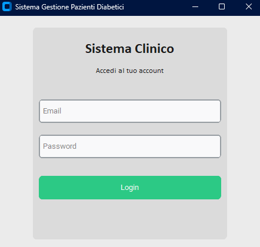
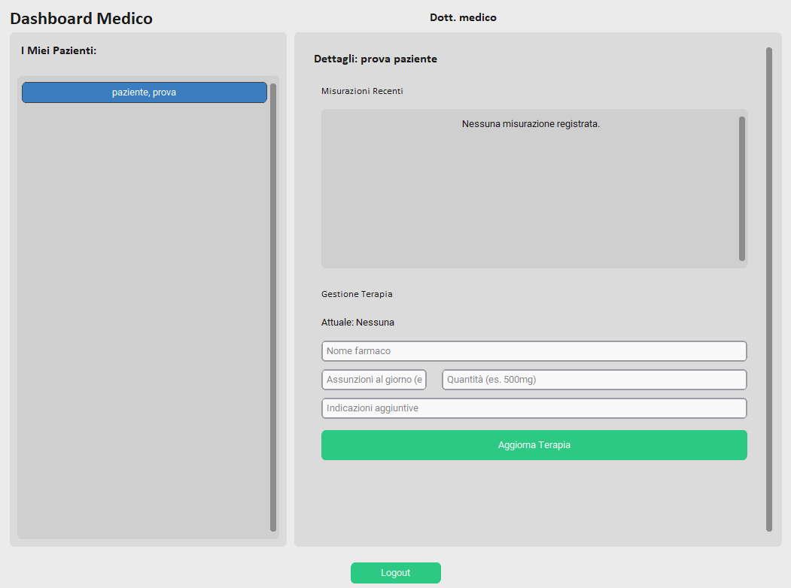
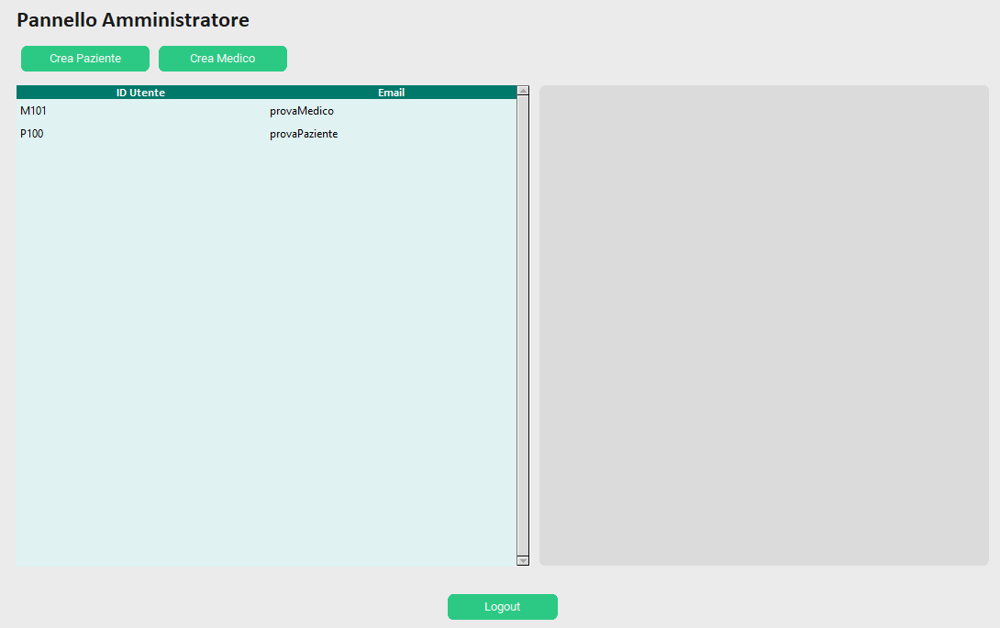

# Sistema di Gestione per Pazienti Diabetici


Applicazione desktop sviluppata in Python per la gestione e il monitoraggio di pazienti affetti da diabete di tipo 2. Il software è stato progettato per facilitare l'interazione strutturata tra Pazienti, Medici e un Amministratore di sistema, ognuno con le proprie funzionalità e permessi dedicati.

Questo progetto è stato realizzato come prova d'esame per il corso di Ingegneria del Software.

---

## 📋 Indice

* [Funzionalità Principali](#-funzionalità-principali)
* [Screenshot dell'Applicazione](#-screenshot-dellapplicazione)
* [Tecnologie Utilizzate](#-tecnologie-utilizzate)
* [Installazione e Avvio](#-installazione-e-avvio)
* [Creazione dell'Eseguibile](#-creazione-delleseguibile)
* [Struttura del Progetto](#-struttura-del-progetto)
* [Autore](#-autore)

---

## ✨ Funzionalità Principali

Il sistema è suddiviso in tre ruoli utente, ognuno con un proprio pannello di controllo e funzionalità dedicate.

### 👤 Paziente
* **Login Sicuro**: Accesso tramite credenziali personali.
* **Dashboard Informativa**: Visualizzazione chiara della terapia prescritta e del proprio medico di riferimento.
* **Registrazione Terapia**: Possibilità di confermare con un click l'avvenuta assunzione del farmaco.
* **Diario Glicemico**: Modulo per registrare i valori di glicemia, il momento della giornata e sintomi opzionali.
* **Alert Istantanei**: Ricezione di un avviso immediato in caso di inserimento di valori glicemici fuori soglia.

### 👨‍⚕️ Medico
* **Accesso Dedicato**: Login con credenziali da medico.
* **Gestione Pazienti Assegnati**: Visualizzazione e gestione **esclusiva** dei pazienti assegnati al proprio profilo, garantendo la privacy.
* **Monitoraggio Completo**: Accesso ai dettagli di un paziente, inclusa la lista completa e aggiornata delle sue misurazioni.
* **Gestione Terapie**: Possibilità di assegnare o aggiornare la terapia di un paziente, con aggiornamento istantaneo dell'interfaccia.
* **Sistema di Allarmi**: Ricezione di notifiche al login nel caso un paziente non registri l'assunzione di farmaci per più di 3 giorni.

### ⚙️ Amministratore
* **Accesso Privilegiato**: Login con credenziali di sistema (`admin`/`admin`).
* **Visione d'Insieme**: Pannello di controllo con una vista ad albero di tutti i medici e dei loro rispettivi pazienti, inclusi quelli non assegnati.
* **Gestione Utenti**: Funzionalità per creare nuovi profili Medico e Paziente.
* **Ciclo di Vita Utenti**: Possibilità di eliminare medici ("Servizio Terminato") e pazienti ("Terapia Conclusa") con finestre di dialogo di conferma per prevenire errori.
* **Riassegnazione Pazienti**: Strumento per spostare un paziente da un medico a un altro in modo semplice e intuitivo.
* **Audit Terapie**: Ispezione di tutte le terapie prescritte da uno specifico medico.

---

## 🖼️ Screenshot dell'Applicazione

| Schermata di Login | Dashboard Paziente |
| :----------------: | :----------------: |
|  |  |
| **Dashboard Medico** | **Pannello Amministratore** |
|  |  |

---

## 🛠️ Tecnologie Utilizzate

* **Linguaggio**: Python
* **Interfaccia Grafica (GUI)**: [CustomTkinter](https://github.com/TomSchimansky/CustomTkinter) - per un aspetto moderno, professionale e personalizzabile.
* **Componenti GUI Nativi**: `tkinter.ttk` per la vista ad albero (`Treeview`) nel pannello admin.
* **Packaging**: [PyInstaller](https://pyinstaller.org/en/stable/) - per la creazione dell'eseguibile standalone `.exe`.

---

## 🚀 Installazione e Avvio

Per eseguire il progetto in locale, segui questi passaggi.

1.  **Clona il repository**
    ```sh
    git clone [https://github.com/paronto/esameIngSoftware.git](https://github.com/paronto/esameIngSoftware.git)
    cd esameIngSoftware
    ```

2.  **Crea un ambiente virtuale** (consigliato)
    ```sh
    python -m venv venv
    ```
    * Su Windows: `.\venv\Scripts\activate`
    * Su macOS/Linux: `source venv/bin/activate`

3.  **Installa le dipendenze**
    Il progetto richiede solo `customtkinter`.
    ```sh
    pip install customtkinter
    ```

4.  **Avvia l'applicazione**
    ```sh
    python main.py
    ```
    Al primo avvio, verrà creato automaticamente il file `dati_clinici.json` con l'utente amministratore di default.
    * **Credenziali Admin**:
        * Email: `admin`
        * Password: `admin`

---

## 📦 Creazione dell'Eseguibile

Per creare un file `.exe` autonomo che non richiede installazioni, esegui questi comandi.

1.  **Installa PyInstaller**
    ```sh
    pip install pyinstaller
    ```

2.  **Esegui il comando di build**
    Dalla cartella principale del progetto, lancia:
    ```sh
    pyinstaller --onefile --windowed --name="GestioneDiabetici" main.py
    ```

3.  **Trova il file `.exe`**
    Il tuo eseguibile si troverà nella cartella `dist/` appena creata.

---

## 📁 Struttura del Progetto

```
.
├── src/
│   ├── admin.py
│   ├── alert_manager.py
│   ├── data_manager.py
│   ├── farmaco_assunto.py
│   ├── gui.py
│   ├── medico.py
│   ├── misurazione.py
│   ├── paziente.py
│   ├── terapia.py
│   └── utente.py
├── screenshot/
│   ├── login.png
│   ├── dashboard_paziente.png
│   ├── dashboard_medico.png
│   └── dashboard_admin.png
├── dati_clinici.json
├── main.py
└── README.md
```

---

## 👨‍💻 Autore

* **Pietro Dal Bosco** - *Studente del corso di Ingegneria del Software, Università di Verona.*

---